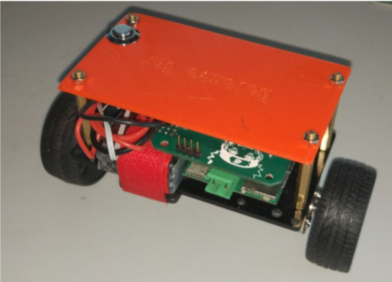
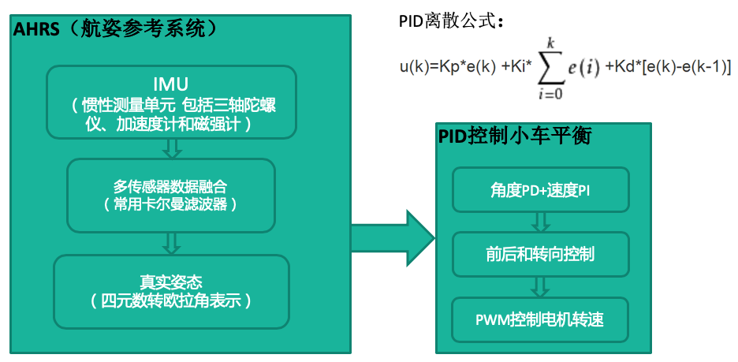
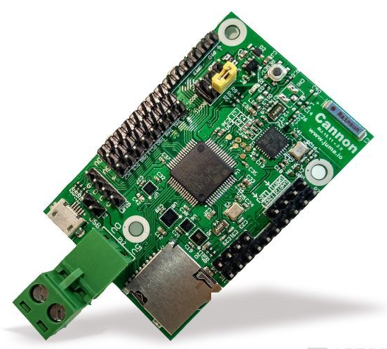
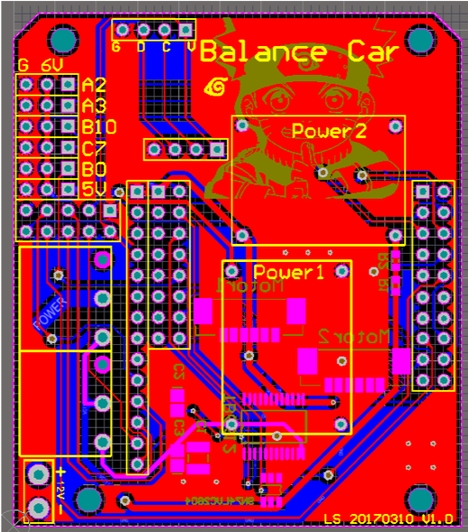
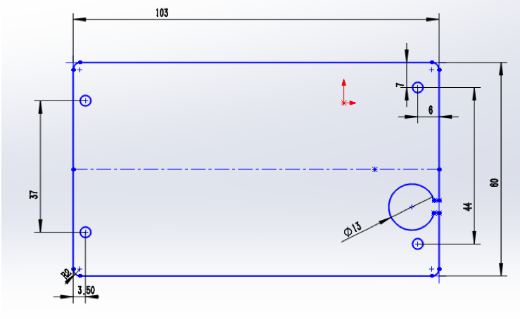
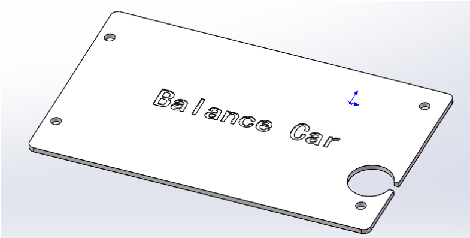

BalanceCar
---

## 平衡小车
包含所有源码、电路设计和文档：
* Android Studio Project
* STM32 Keil Project
* PCB Altium Designer Project
* SolidWorks Project
* 元器件等物料购买链接

## 实物成品

## 算法流程

## 硬件组成
* STM32F401（ARM Cortex-M4 32bit MCU+FPU, 105 DMIPS)
* LSM6DS3
* BlueNRG（Bluetooth low energy 4.0）
* 核心板  

* 驱动板  

## 外壳设计
* 外壳尺寸  

* 外壳3D模型  

